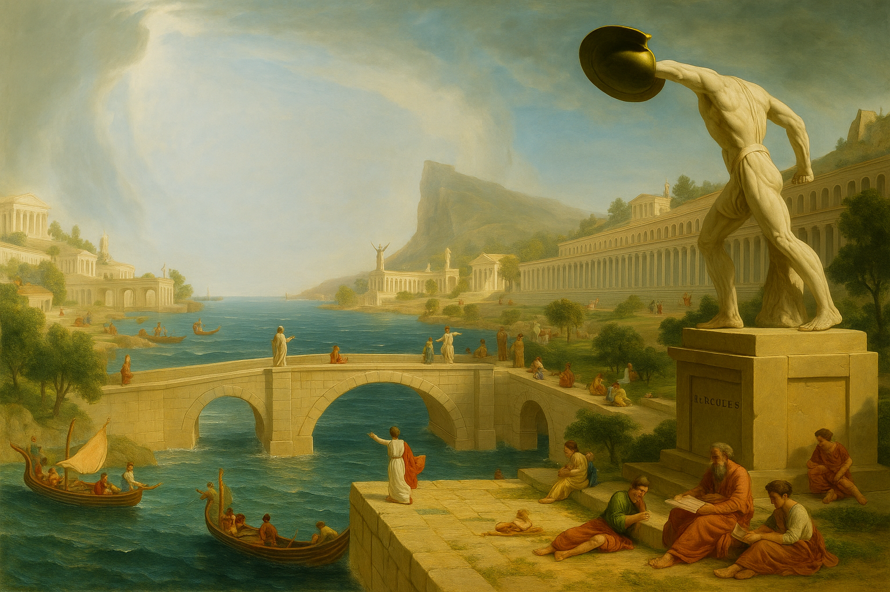

# 🏛️  Alexandria



### Date: 5/29/2025

#### By: Michael Lackey

#### [Website](https://www.michaellackey.com/) | [GitHub](https://github.com/NobodysLackey) | [LinkedIn](https://www.linkedin.com/in/michaelglackey/)

***


### ***Description***

Named after the ancient [Library of Alexandria](https://en.wikipedia.org/wiki/Library_of_Alexandria), ***Alexandria*** is a centralized API for students. It delivers stable, structured, and curated data for projects, labs, and lessons — from Stoic quotes to movie searches — all from one reliable source. Like the ancient library, it is meant to be a single repository of all human knowledge.

Deployed to [https://alexandria-go.fly.dev](https://alexandria-go.fly.dev).

***


### ***Technologies Used***

- [x] Node
- [x] Express
- [x] Mongoose
- [x] MongoDB

***


### ***Endpoints***

Precede all endpoints with `/api`...

<hr>

<details>
<summary>🐕 Dogs</summary>

<br>

<p>Utilizes the <a href="https://dog.ceo/dog-api/documentation/">Dog API</a> to extrapolate dog breeds and images of random dogs based on a breed param.</p>

### /dogs

```json
{
  "status": 200,
  "message": "Successfully retrieved dog breed list!",
  "breeds": [
    "affenpinscher",
    "african",
    "airedale",
    // and so on...
  ]
}
```

### /dogs/:breed

```json
{
  "status": 200,
  "message": "Successfully retrieved random dog picture!",
  "picture": "https://images.dog.ceo/breeds/pug/bobmarley.jpg"
}
```

</details>

<hr>

<details>
<summary>💬 Stoic Quotes</summary>

<br>

<p>Utilizes the <a href="https://github.com/tlcheah2/stoic-quote-lambda-public-api">Stoic Quote API</a> to retrieve a random quote and author.  Circumvents improperly set headers by original API to ensure clean responses.  Cleans up quotes and author data for typos and errors before sending.</p>

### /quotes

```json
{
  "status": 200,
  "message": "Successfully retrieved a random quote!",
  "quote": "Associate with people who are likely to improve you. Welcome those who you are capable of improving. The process is a mutual one: men learn as they teach.",
  "author": "Seneca"
}
```

</details>

<hr>

<details>
<summary>🦆 Random Duck</summary>

<br>

<p>Utilizes the <a href="https://random-d.uk/api">Random Duck API</a> to retrieve a random image of a duck. Yes, you read that correctly.</p>

### /ducks

```json
{
  "status": 200,
  "message": "Successfully retrieved a random duck!",
  "duck": "https://random-d.uk/api/108.jpg"
}
```

</details>

<hr>


### ***Future Updates***

- [x] ~~Deployment~~
- [ ] Front End for user sign up
- [ ] API Keys
- [ ] Publishing

***


### ***Credits***

- [x] [Dogs API](https://dog.ceo/dog-api/documentation/)
- [x] [Stoicism Quotes API](https://github.com/tlcheah2/stoic-quote-lambda-public-api)
- [x] [Random Duck API](https://random-d.uk/api)
- [x] [Disney Character API](https://disneyapi.dev/docs/)

***


### ***Copyright and Ownership***

Alexandria is the intellectual property of **Michael Lackey**. All rights reserved.

No part of this project, including but not limited to code, documentation, or any other related assets, may be reproduced, distributed, or transmitted in any form or by any means, without the prior written permission of **Michael Lackey**.

For inquiries, contact [michael.g.lackey@gmail.com](mailto:michael.g.lackey@gmail.com?subject=Copyright%20Inquiry%20-%20Alexandria).

***
